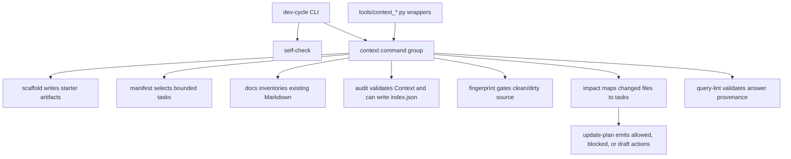

# Context CLI Toolchain

## Role

The installed command is `dev-cycle`, implemented by `dev_cycle.cli`. It is a thin dispatcher over deterministic context helpers. The dispatcher owns command group parsing and `self-check`; each context command module owns its own argument parsing, data model, text output, JSON output, and exit-code policy.

The source-checkout scripts in `tools/context_*.py` are wrappers for local development. They add the repository root to `sys.path`, import the matching `dev_cycle.context.*` module, and delegate to that module's `main()` function. Release checks verify that installed CLI behavior does not depend on the `tools` package.

## Contracts

- Public CLI boundary: `dev-cycle self-check` and `dev-cycle context <command>`.
- Source wrapper boundary: `python3 tools/context_<command>.py` should behave like `dev-cycle context <command>` for source checkouts.
- Context commands are deterministic helpers. They may parse manifests, inspect Git state, classify files, emit JSON, or scaffold templates, but they do not synthesize Context prose.
- Write behavior is explicit. `scaffold` writes only starter artifacts unless `--dry-run` is used; `migrate-plan` requires `--write`; `audit` writes `index.json` only when `--write-index` is supplied. Manifest selection, docs inventory, impact, update-plan, fingerprint checks, and query lint are read-only except for their normal stdout/stderr.
- Exit codes are part of the contract: `0` means success/pass, `1` means policy or lint failures where applicable, and `2` means invalid input or unreadable required files.

## Command Map

| Command | Runtime module | Primary responsibility |
|---|---|---|
| `self-check` | `dev_cycle.cli` | Import every released context command and verify a callable `main()`. |
| `context scaffold` | `dev_cycle.context.scaffold` | Install config, agent guide, manifest template, and reserved directories. |
| `context manifest` | `dev_cycle.context.manifest` | Select bounded manifest tasks by status, tag, ID, source, or context path. |
| `context migrate-plan` | `dev_cycle.context.migrate_plan` | Convert legacy path-only manifest entries into explicit task fields. |
| `context docs` | `dev_cycle.context.docs` | Inventory existing Markdown docs, dead links, manifest comparison coverage, and duplicate hints. |
| `context audit` | `dev_cycle.context.audit` | Validate setup, Context frontmatter, fingerprints, links, manifest coverage, validation files, and optional index generation. |
| `context fingerprint` | `dev_cycle.context.fingerprint` | Generate or check dirty-aware source fingerprints. |
| `context impact` | `dev_cycle.context.impact` | Map a diff or explicit file list to manifest tasks and special Context changes. |
| `context update-plan` | `dev_cycle.context.update_plan` | Turn impact data plus dirty-source gates into bounded update actions. |
| `context query-lint` | `dev_cycle.context.query_lint` | Check provenance-first answer structure and source markers. |

## Interactions

## Design Notes

- `dev_cycle.cli` intentionally avoids command implementation details. The command table is the release boundary between the installed script and context modules.
- `manifest` depends on manifest parsing from `audit` and legacy detection from `migrate_plan`; this keeps status normalization consistent across selection and health checks.
- `impact` maps changed files by manifest sources, context paths, and existing Context fingerprints. This allows updates to start from a diff instead of a full repository scan.
- `update_plan` consumes impact data and re-checks source state before allowing writes. This is the main dirty-source gate for incremental maintenance.
- `audit` is the central schema validator. It also provides shared helpers for path normalization, frontmatter parsing, config parsing, Git state, link checks, and index generation.
- `docs` is intentionally advisory. It reports existing docs coverage and duplicate hints, but the skill layer decides whether existing prose is sufficient.

## SSOT Links

- CLI dispatcher: [dev_cycle/cli.py](../../../dev_cycle/cli.py)
- Context command modules: [dev_cycle/context](../../../dev_cycle/context)
- Source wrappers: [tools](../../../tools)
- Artifact schema: [spec/CONTEXT_SPEC.md](../../../spec/CONTEXT_SPEC.md)
- Release verification: [RELEASE.md](../../../RELEASE.md)

## Blindspots

- This Context does not document every parser edge case in each command module. Use the source and tests for exact error strings and JSON shapes.
- Wrapper files are mechanically similar; Git rename detection may pair them oddly in diffs, but their runtime contract is the imported module name.
