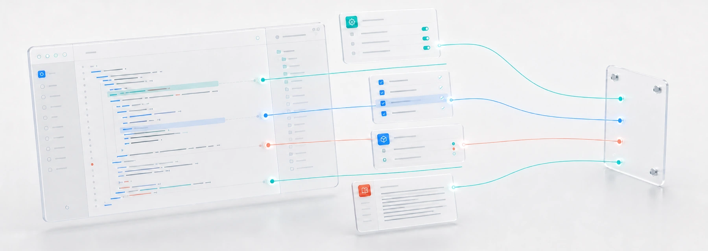

# dev-skeleton

<p align="center">
  
</p>

[English](#english) | [中文](#中文)

## English

Source-first project skeletons for LLM-assisted development.

`dev-skeleton` ships short, LLM-readable skill prompts and copyable templates. It is not tied to any specific agent runtime, and it does not ship a CLI, code indexer, KB builder, or project-management workflow.

Skeletons orient the model before it reads source. They do not answer implementation questions.

### Rules

- Source is authority: code, config, tests, release artifacts, and maintained docs.
- Skeleton is orientation: purpose, non-goals, stable constraints, truth sources, and review preferences.
- Do not mirror modules, classes, functions, call graphs, APIs, or current behavior.
- Let the model inspect source for the task at hand.
- Update skeletons only when durable intent, constraints, truth sources, or review preferences change.
- Routine implementation changes should not update skeletons.

### Source As Index

Source-first is economical only when the code tree preserves clear semantic ownership. Code that shares one intent, lifecycle, invariant, or failure policy should stay together; responsibilities that change independently should separate. Large cohesive modules are acceptable. Mixed-responsibility hubs are not.

Root documentation should route readers to subsystems, and entry modules should route them to semantic owners. Implementation facts still belong in source. Dev-skeleton records durable navigation constraints, not a second inventory of the codebase.

### Layout

```text
skills/
  skeleton-init/
  skeleton-refresh/
  skeleton-audit/
  review-skeleton/
templates/
  DEV_SKELETON.md
  REVIEW_SKELETON.md
  AGENTS.md
```

Root `DEV_SKELETON.md`, `REVIEW_SKELETON.md`, and `AGENTS.md` describe this repo itself.

### Use

Copy the templates into a target repo, then give the relevant skill prompt to your LLM or agent environment:

- `skeleton-init`: create initial skeleton files.
- `skeleton-refresh`: update skeletons after durable direction changes.
- `skeleton-audit`: find over-detail, stale claims, and source-first violations.
- `review-skeleton`: review source and diffs using project review preferences.

Skill distribution is intentionally external to this repo.

### Boundaries

- No persistent implementation KB.
- No source index.
- No CLI.
- No test, onboarding, release, or multi-agent workflow.

### Maintenance

When a skeleton starts explaining how the code works today, delete that detail and point back to source.

## 中文

面向 LLM 辅助开发的 source-first 项目骨架。

`dev-skeleton` 提供简短、可被 LLM 直接阅读的 skill prompt 和可复制模板。它不绑定任何特定 agent runtime，也不提供 CLI、代码索引、KB 构建器或项目管理流程。

Skeleton 的作用是在模型阅读源码前提供方向感。它不回答实现细节问题。

### 规则

- 源码优先：代码、配置、测试、release 产物和维护中的文档才是权威。
- 骨架只做定向：记录目的、非目标、稳定约束、事实来源和 review 偏好。
- 不镜像模块、类、函数、调用图、API 或当前行为。
- 让模型根据当前任务动态阅读源码。
- 只有长期意图、约束、事实来源或 review 偏好变化时，才更新 skeleton。
- 日常实现改动不应该触发 skeleton 更新。

### 源码作为索引

只有当代码树保持清晰的语义所有权时，source-first 才是经济的。共享同一意图、生命周期、不变量或失败策略的代码应当聚合；因不同原因独立变化的责任应当分离。大而内聚的模块可以保留，混合责任的中心文件不应继续增长。

根文档负责指向子系统，入口模块负责指向语义 owner，实现事实仍以源码为准。Dev-skeleton 只记录长期有效的导航约束，不维护第二份代码清单。

### 结构

```text
skills/
  skeleton-init/
  skeleton-refresh/
  skeleton-audit/
  review-skeleton/
templates/
  DEV_SKELETON.md
  REVIEW_SKELETON.md
  AGENTS.md
```

根目录的 `DEV_SKELETON.md`、`REVIEW_SKELETON.md` 和 `AGENTS.md` 描述的是本仓库自身。

### 使用

把模板复制到目标仓库，然后把对应的 skill prompt 交给你使用的 LLM 或 agent 环境：

- `skeleton-init`：创建初始 skeleton 文件。
- `skeleton-refresh`：在长期方向变化后更新 skeleton。
- `skeleton-audit`：检查过度细节、陈旧声明和 source-first 违规。
- `review-skeleton`：基于项目 review 偏好审查源码和 diff。

Skill 分发方式刻意留给外部系统处理。

### 边界

- 不做持久化实现 KB。
- 不做源码索引。
- 不做 CLI。
- 不做测试、新人引导、release 或多 agent 工作流。

### 维护

当 skeleton 开始解释“当前代码如何工作”时，删掉这部分细节，让模型回到源码。
