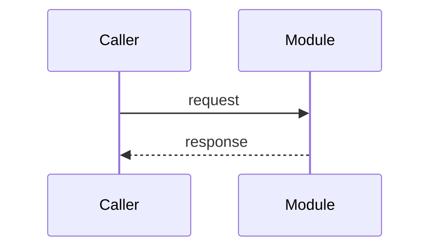

# Example Task

## Role

Describe what this module owns in the system.

## Contracts

- Public API or cross-module contract:
- Inputs and outputs:
- Error and boundary behavior:

## Design Notes

Capture non-obvious trade-offs and why the current shape exists.

## Interactions

## SSOT Links

- Related module: [other.md](../other.md)

## Blindspots

- Record known gaps instead of filling them with guesses.
